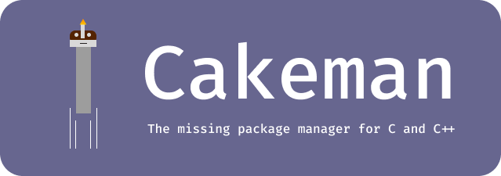

# Cakeman
The missing package manager for C and C++

> [!WARNING]
> Cakeman is not ready for production use yet. Please wait until final release

## Installation
### Windows
Open PowerShell **as an administrator**

Run this comnand:
```powershell
irm "https://github.com/beaglesoftware/cakeman/blob/main/tools/install.ps1" | iex
```

If you're on Windows 11 24H2, you're lucky. Open PowerShell **not as an administrator** and run this command:
```powershell
irm "https://github.com/beaglesoftware/cakeman/blob/main/tools/install.ps1" | sudo iex
```
It will ask for permission, click on Yes

### Mac and Linux
Open your terminal (Example: Mac's default terminal, iTerm2 or anything)

Run this command:
```shell
sh -c "$(curl -fsSL https://github.com/beaglesoftware/cakeman/blob/main/tools/install.ps1)"
```

## Build from source
Install [Go](https://go.dev/dl/)

### Mac or Linux:
Run these commands:
```shell
export OS "$(uname)"
export ARCH "$(uname -m)"
go build main.go -o dist/$OS/$ARCH/cakeman 
./dist/$OS/$ARCH/debug/cakeman 
```

### Windows
Run these commands:
```powershell
$ARCH = $env:PROCESSOR_ARCHITECTURE
go build main.go -o "dist/windows/$ARCH/cakeman.exe "
./dist/windows/$ARCH/cakeman.exe 
```

## Features
App is not ready yet. Come back soon!
